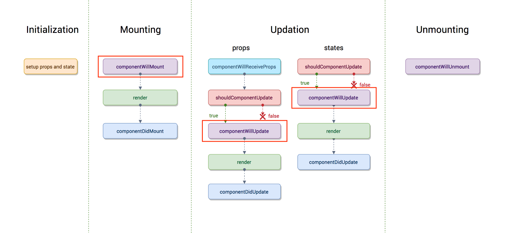

# React v16.3 版本新生命周期函数浅析及升级方案
一个月前，React 官方正式发布了 v16.3 版本。在这次的更新中，除了前段时间被热烈讨论的[新 Context API](https://zhuanlan.zhihu.com/p/33925435) 之外，新引入的两个生命周期函数 `getDerivedStateFromProps`，`getSnapshotBeforeUpdate` 以及在未来 v17.0 版本中将被移除的三个生命周期函数 `componentWillMount`，`componentWillReceiveProps`，`componentWillUpdate` 也非常值得我们花点时间去探究一下其背后的原因以及在具体项目中的升级方案。

## componentWillMount
### 首屏无数据白屏
在现在的 React 应用中，许多开发者为了避免第一次渲染时页面因为没有获取到异步数据而导致白屏，将数据请求部分的代码放在了 `componentWillMount` 中，希望可以避免这种情况并提早异步请求的发送时间。但事实上在 `componentWillMount` 执行后，第一次渲染就已经开始了，所以如果在 `componentWillMount` 执行时还没有获取到异步数据的话，页面首次渲染时也依然会处于没有异步数据的状态。换句话说，组件在首次渲染时总是会处于没有异步数据的状态，不论在哪里发送数据请求。而关于[提早发送数据请求](https://gist.github.com/bvaughn/89700e525ff423a75ffb63b1b1e30a8f)，官方鼓励将数据请求部分的代码放在组件的 `constructor` 中，而非 `componentWillMount`。

另一个常见的 `componentWillMount` 的用例是在服务端渲染时获取数据，因为在服务端渲染时 `componentDidMount` 是不会被调用的。针对这个问题，笔者这里提供两种解法。第一个简单的解法是将所有的数据请求都放在 `componentDidMount` 中，即只在客户端请求异步数据。这样做可以避免在服务端和客户端分别请求两次相同的数据（`componentWillMount` 在客户端渲染时同样会被调用），但很明显的缺点就是无法在服务端渲染时就获取到页面渲染所需要的所有数据，所以如果我们需要保证服务端返回的 HTML 就是用户最终看到的 HTML 的话，我们可以将每个页面的数据获取逻辑单独抽离出来，然后将他们一一对应到相应的页面，在服务端根据当前页面的路由找到相应的数据请求，利用链式的 Promise 在渲染最终的页面前将数据塞入 redux store 或其他数据管理工具中，这样服务端返回的 HTML 就是包含异步数据的内容了。

### componentWillMount 与 componentWillUnmount
另一个常见的用例是在 `componentWillMount` 中订阅事件，并在 `componentWillUnmount` 中取消掉相应的事件订阅。但事实上 React 并不能够保证在 `componentWillMount` 被调用后，同一组件的 `componentWillUnmount` 也一定会被调用。一个当前版本的例子如服务端渲染时，`componentWillUnmount` 是不会在服务端被调用的，在 `componentWillMount` 中订阅事件会直接导致服务端的内存泄漏。另一方面，在未来 React 开启异步渲染模式后，`componentWillMount` 被调用之后，组件的渲染也很有可能会被其他的事务所打断，导致 `componentWillUnmount` 不会被调用。解决这个问题的方案也非常简单，因为 `componentDidMount` 就不存在这个问题，在 `componentDidMount` 被调用后，`componentWillUnmount` 一定会随后被调用以清除组件中存在的事件订阅。

### 升级方案
将现有 `componentWillMount` 中的代码迁移至 `componentDidMount` 即可。

## componentWillReceiveProps
### 更新由 props 所决定的 state 及处理特定情况下的回调
在老版本的 React 中，如果组件自身的某个 state 跟其 props 密切相关的话，一直都没有一种很优雅的处理方式，需要在 `componentWillReceiveProps` 中去判断前后两个 props 是否相同，如果不同再将新的 props 更新到相应的 state 上去。这样做一来会破坏 state 数据的单一数据源，导致组件状态变得不可预测，另一方面也会增加组件的重绘次数。但由于类似的业务需求很多，如一个可以横向滑动的列表，当前高亮的 Tab 隶属于列表自身的状态，但很多情况下，业务需求会要求从外部跳转至列表时，根据当前的某个值，直接定位到某个 Tab。

在新版本中，React 官方提供了一个更为简洁的生命周期函数：

```javascript
static getDerivedStateFromProps(nextProps, prevState)
```

一个简单的例子如下：

```javascript
// before
componentWillReceiveProps(nextProps) {	
  if (nextProps.translateX !== this.props.translateX) {
    this.setState({	
      translateX: nextProps.translateX,	
    });	
  }	
}

// after
static getDerivedStateFromProps(nextProps, prevState) {
  if (nextProps.translateX !== prevState.translateX) {
    return {
      translateX: nextProps.translateX,
    };
  }
  return null;
}
```

乍看下来这二者好像并没有什么本质上的区别，但这却是笔者认为非常能够体现 React 团队对于软件工程深刻理解的一个改动，即 **React 团队试图通过框架级别的 API 来约束或者说帮助开发者写出可维护性更佳的 JavaScript 代码**。为了解释这点，我们再来看一段代码：

```javascript
// before
componentWillReceiveProps(nextProps) {
  if (nextProps.isLogin !== this.props.isLogin) {
    this.setState({	
      isLogin: nextProps.isLogin,	
    });
  }
  if (nextProps.isLogin) {
    this.handleClose();
  }
}
```

```
// after
static getDerivedStateFromProps(nextProps, prevState) {
  if (nextProps.isLogin !== prevState.isLogin) {
    return {
      isLogin: nextProps.isLogin,
    };
  }
  return null;
}

componentDidUpdate(prevProps, prevState) {
  if (!prevState.isLogin && this.props.isLogin) {
    this.handleClose();
  }
}
```

通常来讲，在 `componentWillReceiveProps` 中，我们一般会做以下两件事，一是根据 props 的更新来更新 state，二是触发一些回调，如动画或页面跳转等。在老版本的 React 中，这两件事我们都需要在 `componentWillReceiveProps` 中去做。而在新版本中，官方将更新 state 与触发回调重新分配到了 `getDerivedStateFromProps` 与 `componentDidUpdate` 中，使得组件整体的更新逻辑更为清晰。而且在 `getDerivedStateFromProps` 中还禁止了组件去访问 prevProps，强制让开发者去比较 nextProps 与 prevState 中的值，以确保当开发者用到 `getDerivedStateFromProps` 这个生命周期函数时，就是在根据当前的 props 来更新组件的 state，而不是去做其他一些让组件状态变得更加不可预测的事情。

### 升级方案
将现有 `componentWillReceiveProps` 中的代码根据更新 state 或回调，分别在 getDerivedStateFromProps 及 componentDidUpdate 中进行相应的重写即可，注意新老生命周期函数中 `prevProps`，`this.props`，`nextProps`，`prevState`，`this.state` 的不同。

## componentWillUpdate
### 处理因为 props 改变而带来的副作用
与 `componentWillReceiveProps` 类似，许多开发者也会在 `componentWillUpdate` 中根据 props 的变化去触发一些回调。但不论是 `componentWillReceiveProps` 还是 `componentWillUpdate`，都有可能在一次更新中被调用多次，也就是说写在这里的回调函数也有可能会被调用多次，这显然是不可取的。与 `componentDidMount` 类似，`componentDidUpdate` 也不存在这样的问题，一次更新中 `componentDidUpdate` 只会被调用一次，所以将原先写在 `componentWillUpdate` 中的回调迁移至 `componentDidUpdate` 就可以解决这个问题。

### 在组件更新前读取 DOM 元素状态
另一个常见的 `componentWillUpdate` 的用例是在组件更新之前，读取当前某个 DOM 元素的状态，并在 `componentDidUpdate` 中进行相应的处理。但在 React 开启异步渲染模式后，render 阶段和 commit 阶段之间并不是无缝衔接的，也就是说在 render 阶段读取到的 DOM 元素状态并不总是和 commit 阶段相同，这就导致在 commit 阶段使用 render 阶段读取到的 DOM 元素状态失去了意义，因为它很有可能已经失效了。

为了解决上面提到的这个问题，React 提供了一个新的生命周期函数：

```javascript
getSnapshotBeforeUpdate(prevProps, prevState)
```

与 `componentWillUpdate` 不同，`getSnapshotBeforeUpdate` 会在最终的 render 之前被调用，也就是说在 `getSnapshotBeforeUpdate` 中读取的 DOM 元素状态是可以保证与 `componentDidUpdate` 中一致的。虽然 `getSnapshotBeforeUpdate` 不是一个静态方法，但我们应该尽量使用它去返回一个值，这个值会随后被传入 `componentDidUpdate`，并在 `componentDidUpdate` 中去更新组件的最终状态，而不是在 `getSnapshotBeforeUpdate` 中直接更新组件状态。

官方提供的一个例子如下：

```javascript
class ScrollingList extends React.Component {
  listRef = null;

  getSnapshotBeforeUpdate(prevProps, prevState) {
    // Are we adding new items to the list?
    // Capture the scroll position so we can adjust scroll later.
    if (prevProps.list.length < this.props.list.length) {
      return (
        this.listRef.scrollHeight - this.listRef.scrollTop
      );
    }
    return null;
  }

  componentDidUpdate(prevProps, prevState, snapshot) {
    // If we have a snapshot value, we've just added new items.
    // Adjust scroll so these new items don't push the old ones out of view.
    // (snapshot here is the value returned from getSnapshotBeforeUpdate)
    if (snapshot !== null) {
      this.listRef.scrollTop =
        this.listRef.scrollHeight - snapshot;
    }
  }

  render() {
    return (
      <div ref={this.setListRef}>
        {/* ...contents... */}
      </div>
    );
  }

  setListRef = ref => {
    this.listRef = ref;
  };
}
```

### 升级方案
将现有的 `componentWillUpdate` 中的回调函数迁移至 `componentDidUpdate`。如果某些回调函数需要用到 DOM 元素的状态，则将对比或计算的过程迁移至 `getSnapshotBeforeUpdate`，然后在 `componentDidUpdate` 中统一调用回调或更新状态。

## 小结
最后，让我们从整体的角度再来看一下 React 这次生命周期函数调整前后的异同：

#### Before


#### After


在第一张图中红框圈起来的三个生命周期函数就是在新版本中即将被移除的。通过上述的两张图，我们可以清楚地看到将要被移除的三个生命周期函数都是在 render 之前会被调用到的。而根据原来的设计，在这三个生命周期函数中都是可以去做一些诸如发送请求，setState 等包含副作用的事情的。在老版本的 React 中，这样也许只会带来一些性能上的损耗，但在 React 开启异步渲染模式之后，是无法接受这样的副作用产生的。举一个 Git 的例子就是在开发者 commit 了 10 个文件更新后，又对当前或其他文件做了另外的更新，但在 push 的时候却仍然只 push 了刚才 commit 的 10 个文件更新。这样显然会导致提交记录与实际更新不符，如果想要避免这些问题，就需要保证每一次的文件更新都要经过 commit 阶段，再被提交到远端，而这也就是在 React 开启异步渲染之后所要做到的。

另一方面，为了验证个人的理解及测试新版本的稳定性，笔者已经将个人负责的几个项目全部都升级到了 React 16.3 并根据上述提到的升级方案替换了所有即将被移除的生命周期函数。目前所有项目在生产环境中都运行良好，没有收到任何不良的用户反馈。

当然，以上的这些生命周期函数的改动，一直要到 React 17.0 中才会实装，这给广大的 React 开发者们预留了充足的时间去适应这次改动。但如果你是 React 开源项目（尤其是组件库）的维护者，不妨花点时间了解一下这次生命周期函数的改动，这不仅仅可以帮助你将开源项目更好地升级到最新版本，更重要的是可以帮助你提前理解即将到来的异步渲染模式。笔者相信，在 React 开启异步渲染之后，许多常用组件的性能将很有可能迎来一次整体的提升，配合异步渲染，许多现在的复杂组件可以在代码层面被处理得更加优雅，并最终为用户带来更加直观的使用体验。